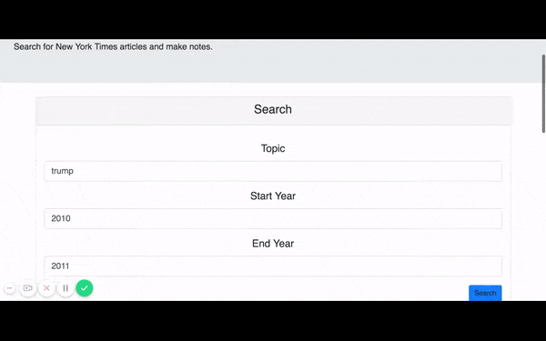

## New York Times API React Application

This application allows users to enter a topic, start year, and end year as search parameters. When they click search, the data is passed to the New York Times articles API. A maximum of five results are displayed in a component below the search component, which conditionally appears when more than one article is present. Users have the option to save an article, and the chosen article is pushed to a MongoDB database. Users can also delete the articles. 

Note that the application was deployed to Heroku, so you may experience some delay in loading the app. 

[Use the application here](https://mighty-reef-39302.herokuapp.com/)

## Technologies Used

React, Express, Node, JavaScript, HTML/CSS, Bootstrap

## Challenges and Learning Summary

This application uses Create-React-App, which I have used previously, so I was familiar with the set-up. I enjoyed learning how to conditionally render whole components within other components, because this will come in handy I am sure. I still had to wrap my head around the APIs and how the data from the front end communicates with the back end, whether through params or otherwise. 